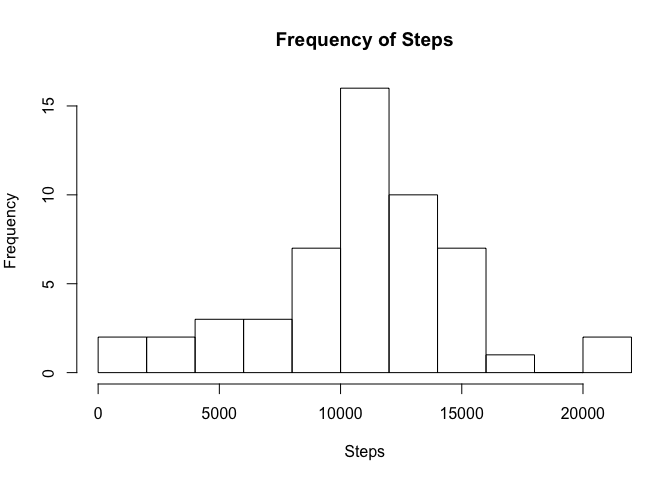
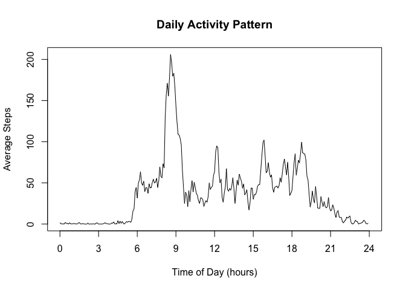
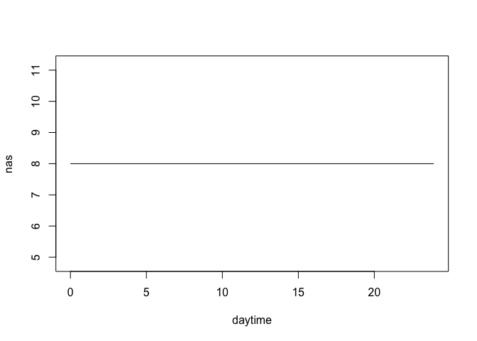
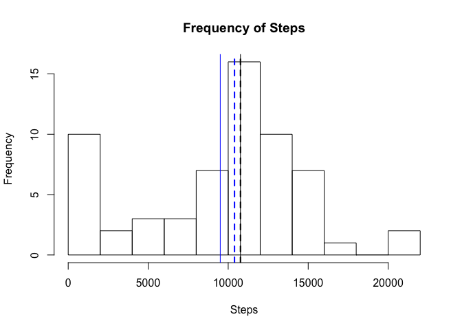
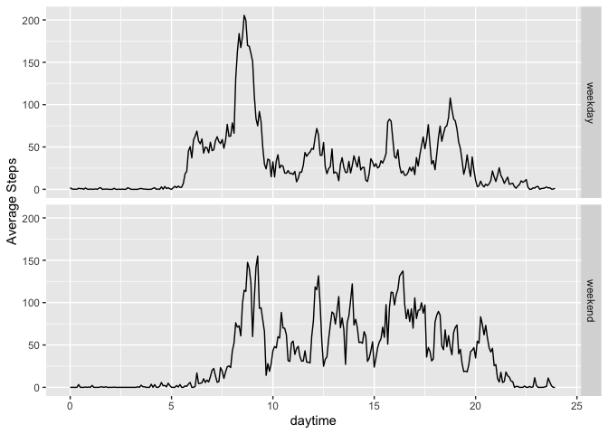

```r
knitr::opts_chunk$set(
    warning = FALSE,
    message = FALSE
)
```

## Loading and preprocessing the data

The data are mostly ready to go. I took issue only the the interval column. These reflect time of day but when used in a time-series plot will have some unexpected results. For instance, 100 is only 5 minutes after 55, but there will be some gap in the time series are these will be interpreted as integers. Thus we left pad 0 to the the interval until it is of size 4 and then create two new columns. One which gives the full datetime of the observation and another that gives the time of the observation as a decimal number of hours. 

```r
library(readr, quietly = TRUE) 
library(stringr, quietly = TRUE)
library(dplyr, quietly = TRUE)
library(lubridate, quietly = TRUE)
#Check to see if file exists
actfile <- "activity.zip"
if(!(actfile %in% dir())){
    stop("Activity.zip file not found in working directory.")
}
#unzip the archive
unzip(actfile)
#read the .csv file to activity
activity <- read_csv("activity.csv")

#recode the intervals (5 -> 0005), add a column that reflects the intervals as datetimes, add a column that reflects them as times of day with a decimal number of hours
activity <- activity %>%
    mutate(interval = str_pad(as.character(interval), 4, side= "left", pad = "0")) %>%
    mutate(datetime = ymd_hm(
        paste(date, " " , substr(interval, 1, 2),":",substr(interval, 3, 4),sep = ""))) %>%
    mutate(daytime = hour(datetime)+minute(datetime)/60)

### Show the head
head(activity)
```

```
## # A tibble: 6 x 5
##   steps date       interval datetime            daytime
##   <dbl> <date>     <chr>    <dttm>                <dbl>
## 1    NA 2012-10-01 0000     2012-10-01 00:00:00  0     
## 2    NA 2012-10-01 0005     2012-10-01 00:05:00  0.0833
## 3    NA 2012-10-01 0010     2012-10-01 00:10:00  0.167 
## 4    NA 2012-10-01 0015     2012-10-01 00:15:00  0.25  
## 5    NA 2012-10-01 0020     2012-10-01 00:20:00  0.333 
## 6    NA 2012-10-01 0025     2012-10-01 00:25:00  0.417
```


## What is mean total number of steps taken per day?
Here we sum the number of steps for each observation taken on a given day. 


```r
stepactivity <- activity %>%
    group_by(date) %>%
    summarise(total_steps = sum(steps))

par(mar = c(5, 4, 4, 1))
hist(stepactivity$total_steps,
     breaks = 10,
     xlab = "Steps",
     main = "Frequency of Steps")
```

<!-- -->

We can simply take the mean and median from the data above. 


```r
dailymean <- mean(stepactivity$total_steps, na.rm = TRUE)
dailymedian <- median(stepactivity$total_steps, na.rm = TRUE)
dailymean
```

```
## [1] 10766.19
```

```r
dailymedian
```

```
## [1] 10765
```

This is a very active user taking more than 10,765 steps on at least half of the days. 

## What is the average daily activity pattern?
Now we must take the mean over all the observations taken in a particular interval. We use the decimal representation of the hours to get sensible labels on the x-axis of the plot. 


```r
dailyactivity <- activity %>% 
    group_by(daytime)  %>%
    summarise(average_steps = mean(steps, na.rm = TRUE))


with(dailyactivity,
     plot(daytime, average_steps,
          type = "l",
          xlab = "Time of Day (hours)",
          ylab = "Average Steps",
          main = "Daily Activity Pattern",
          xaxt = "n",
          xlim = c(0,24)
          )
     )
     axis(1, at = seq(0,24, by = 3))
```

<!-- -->

```r
maxindex <- which(dailyactivity$average_steps == max(dailyactivity$average_steps))

### decimal time of day of highest activity
maxtime <- dailyactivity$daytime[maxindex]
trunc(maxtime) * 100 + (maxtime - trunc(maxtime)) * 60
```

```
## [1] 835
```


## Imputing missing values

In the final Swirl lesson of the "Exploratory Data Analysis" course, some values are NA or negative. The strategy there was to look for common features of those measures and put forward a hypothesis as to the cause of the error. I would like to do the same thing here so I have included this histogram to see during which parts of the day is the activity monitor data likely to be NA. Perhaps there are times of day where the monitor is simply not worn or perhaps it records no activity. In the former case, a median may be a good substitute for NA where as in the latter a value of 0 may be a better choice. 

The data are only missing in the steps column.

```r
sum(is.na(activity$steps))
```

```
## [1] 2304
```

```r
sum(is.na(activity$date))
```

```
## [1] 0
```

```r
sum(is.na(activity$interval))
```

```
## [1] 0
```

The following figure is outside the requirements of the assignment but is used to justify my choice of what value to imput for NA. We see if some particular part of the day is more likely to have a NA associated with it. 


```r
naactivity <- activity[is.na(activity$steps),]
natimes <- naactivity %>% 
    group_by(daytime)  %>%
    summarise(nas = n())

with(natimes,
     plot(daytime, nas,
          type = "l"))
```

<!-- -->

Each interval has exactly 8 NA entries. This suggests that the missing data correspond to 8 dates. This is confirmed below. 


```r
nadates <- unique(naactivity$date)
nadates
```

```
## [1] "2012-10-01" "2012-10-08" "2012-11-01" "2012-11-04" "2012-11-09"
## [6] "2012-11-10" "2012-11-14" "2012-11-30"
```

It seems unlikely that an individual would have no activity at all for an exact 24 hour period. A better option is to replace the NAs with a measure of central tendency for that same daytime interval across the whole data set. Median is chosen due to the likelihood that the data are skewed. 

This is achieved calculated the median number of steps for each time interval, creating a vector of these values named 'medians' and assigning these values to the missing entries. 


```r
medactivity <- activity %>%
    group_by(daytime) %>%
    mutate(median_steps = median(steps, na.rm = TRUE))
medians <- medactivity[is.na(medactivity$steps), ]$median_steps
activity$steps[is.na(activity$steps)]  <- medians
```


```r
stepactivity <- activity %>%
    group_by(date) %>%
    summarise(total_steps = sum(steps))

hist(stepactivity$total_steps,
     breaks = 10,
     xlab = "Steps",
     main = "Frequency of Steps")

newmean <- mean(stepactivity$total_steps, na.rm = TRUE)
newmedian <- median(stepactivity$total_steps, na.rm = TRUE)
abline(v = dailymean)
abline(v = dailymedian, lty = 2, lwd = 2)
abline(v = newmean, col = "blue")
abline(v = newmedian, col = "blue", lty =2, lwd =2)
```

<!-- -->

```r
newmean
```

```
## [1] 9503.869
```

```r
newmedian
```

```
## [1] 10395
```
We can see that the mean and median number of steps have had a small decrease over this time. The daily mean decreased from 10766 to 9504, a 12% decrease (black solid line vs. blue solid line). This should really be seen as a criticism to the quality of the above analysis as we have no idea the activity of the user on the missing days but the missing data has a substantial effect on the outcomes. The median (dashed lines) is more robust to this change seeing only a 3% decrease from 10765 to 10395. The histogram shows that the imput strategy produced low activity days (less than 2000 steps). 

## Are there differences in activity patterns between weekdays and weekends?

A vectorized function is defined to add an additional factor to the data distinguishing weekdays from weekends. This is built on the wday() function in the lubridate library. Ggplot2 is used to create the panel graph. 

The graph shows that the user tends to be more active on weekend afternoons than weekday afternoons. 

```r
#takes a datetime and appropriately outputs "weekday" or "weekend" as factor
codeweekday <- function(datetime){
    daynum <- wday(datetime)
    if(daynum %in% c(2:6)){
        as.factor("weekday")
    } else {
        as.factor("weekend")
    }
}

codeweekday <- Vectorize(codeweekday)
activity <- activity %>%
    mutate(weekday = codeweekday(datetime))

weekendactivity <- activity %>%
    group_by(daytime, weekday) %>%
    summarise(average_steps = mean(steps))
library(ggplot2, quietly = TRUE)
ggplot(weekendactivity, aes(daytime, average_steps)) +
    geom_line() +
    facet_grid(weekday ~ .) +
    ylab("Average Steps") +
    xlim(0, 24)
```

<!-- -->
